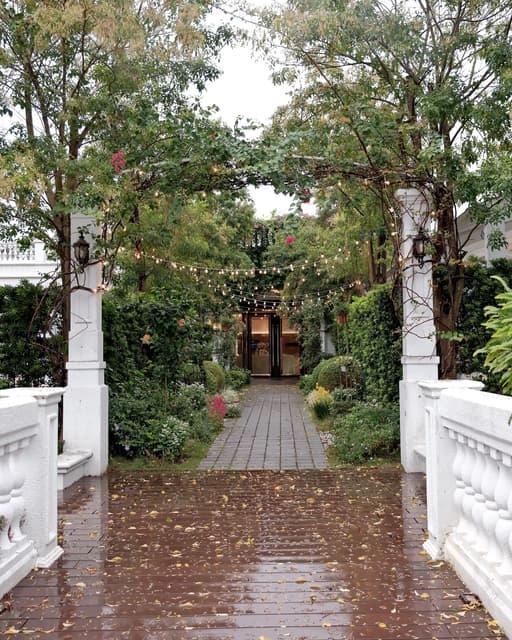
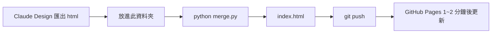

# Leo & Julie 婚禮邀請函

### [進入邀請與回函網頁🤞](https://enting8696.github.io/weddingWeb/)

<p align="center"></p>


## 檔案說明

| 檔案 | 用途 |
|---|---|
| `index.html` | 網站本體（`merge.py` 產生） |
| `merge.py` | 把設計稿匯出的 HTML 加工成 `index.html` |
| `rsvp_submit.js` | 回函送到 Google 表單的程式（`merge.py` 會自動貼進網頁） |
| `open_external.js` | 在 LINE / FB / IG 內開啟時，引導改用外部瀏覽器（同上） |

## Method



```powershell
cd "D:\Leo\其他\weddingWeb"
# 1. 把匯出的 html 放進資料夾（只能放一個，舊的先刪）
python merge.py
# 2. 確認沒問題後刪掉匯出檔，再推上 Git
```

> 沒有新匯出檔時，`python merge.py` 會直接修補現有的 `index.html`。

## 設定常數（`merge.py`）

| 設定 | 說明 |
|---|---|
| `TITLE` / `DESCRIPTION` | 分享到 LINE、FB 時的標題與說明文字 |
| `IMAGE_URL` | 分享縮圖網址（postimg 直接連結） |
| `PHOTO_POS_X` / `PHOTO_POS_X_WIDE` | 背景照片左右位置（手機 / 電腦），數字越小人物越往右 |
| `THANKS_COME` / `THANKS_NOT` | 送出回函後的感謝文字（有出席 / 不克出席） |
